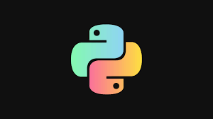

# Hack - open-source ProgrammingProblemSolving Website

# ProgrammingProblemSolving
Website having Problem solving Programming questions in C++ and Python

 

Before proceeding read => [How to contribute](https://github.com/Akash88585/ProgrammingProblemSolving/blob/main/CONTRIBUTING.md)

## Languages used :
* C++
* Python
* HTML

Before raising PR, make sure you were assigned to that issue.

Thank you everyone for your participation!!

### Our Contributors:

